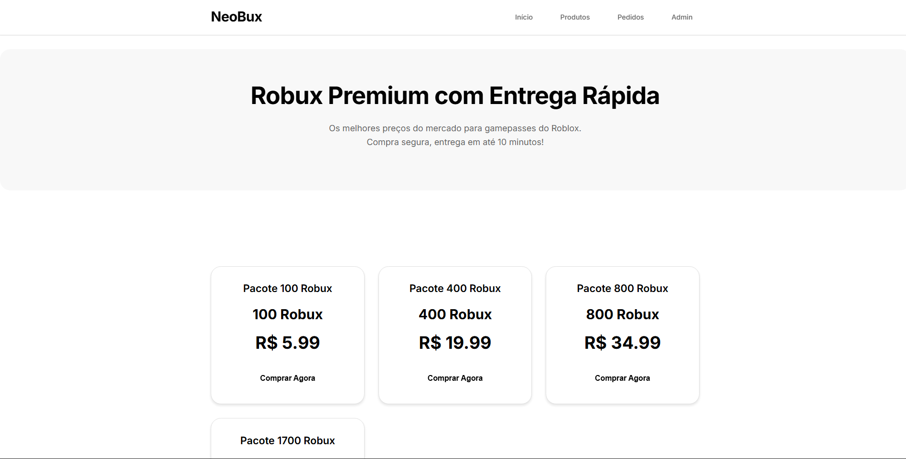
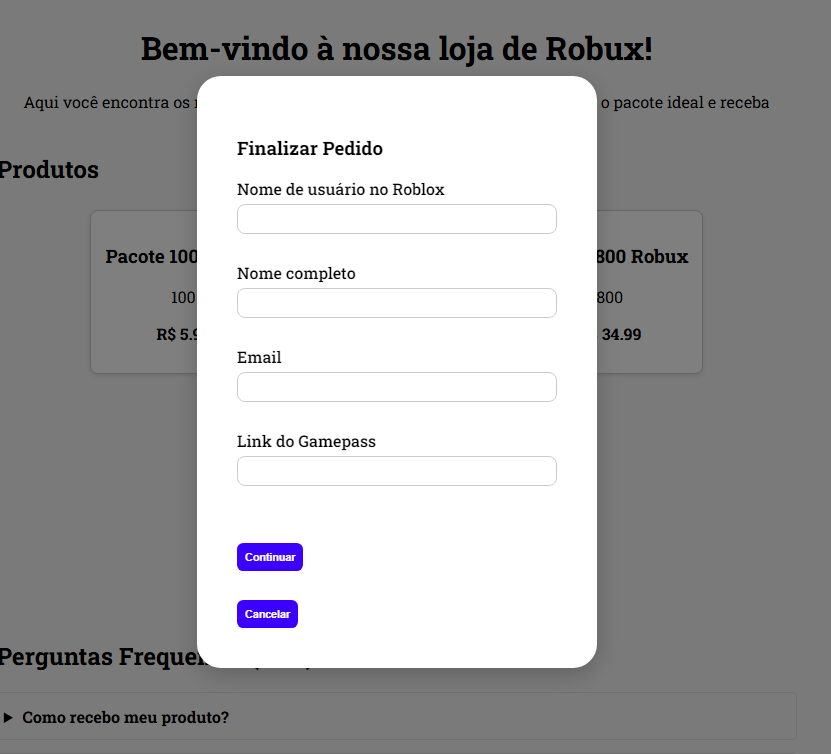
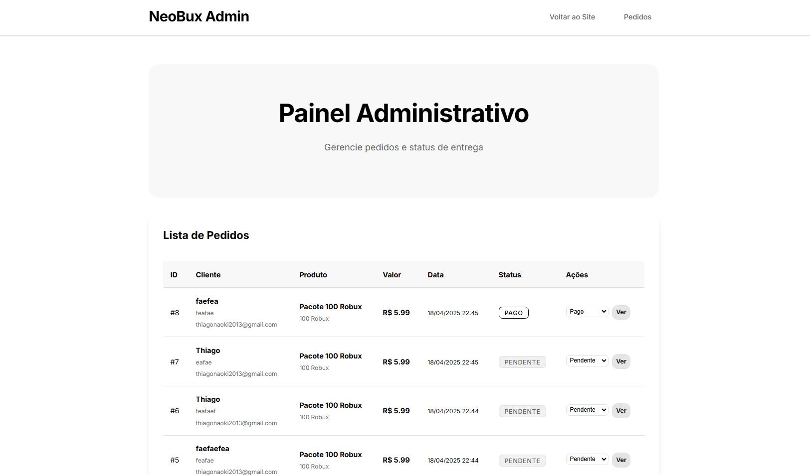

# 🛒 NeoBux - Loja de Robux

Este é um projeto de uma loja virtual de **Robux**, a moeda do jogo Roblox, desenvolvida com o microframework **Flask**. A aplicação permite que usuários façam pedidos de Robux, preencham formulários e que os dados sejam salvos em um banco de dados SQLite.

## 📸 Preview do Projeto
<!-- 
### 🎥 Demonstração em Vídeo

*Demonstração completa do fluxo de compra e painel administrativo* -->

### 🏠 Página Principal

*Interface principal da loja com catálogo de produtos e design minimalista*

### 🛒 Modal de Compra

*Modal de checkout com formulário de pedido e sistema de pagamento PIX*

### 📊 Painel Administrativo

*Dashboard administrativo para gerenciar pedidos e status*

---

## ✨ Características Visuais

- **🎨 Design Minimalista**: Paleta preto e branco com foco na simplicidade
- **💎 Liquid Glass**: Botões com efeito glassmorphism estilo iPhone 16
- **📱 Responsivo**: Interface adaptável para todos os dispositivos
- **⚡ Performance**: Animações suaves e carregamento rápido
- **🔒 Seguro**: Validação de formulários e dados protegidos

## 🚀 Tecnologias utilizadas

- 🐍 **Python 3.7+**
- 🌐 **Flask 2.3.3**
- 🧠 **Flask-WTF** (validação de formulários)
- 🗃️ **SQLAlchemy** (ORM)
- 💾 **SQLite** (banco de dados)
- 🎨 **HTML + CSS**

## 📋 Pré-requisitos

- Python 3.7 ou superior
- pip (gerenciador de pacotes do Python)

## 🚀 Instalação e Execução

### Método 1: Instalação Automática (Recomendado)

```bash
# 1. Navegue até a pasta do projeto
cd "C:\Users\thiago\Área de Trabalho\NeoBux\Flask-WebSite---NeoBux"

# 2. Execute o script de instalação
python instalar.py

# 3. Execute a aplicação
python main.py
```

### Método 2: Instalação Manual

```bash
# 1. Navegue até a pasta do projeto
cd "C:\Users\thiago\Área de Trabalho\NeoBux\Flask-WebSite---NeoBux"

# 2. Instale as dependências
pip install -r requirements.txt

# 3. Crie o banco de dados
python criar_banco.py

# 4. Execute a aplicação
python main.py
```

## 🌐 Acesso

Após executar `python main.py`, acesse:

### 🏠 **Páginas Principais**
- **Loja**: http://localhost:5000
- **Pedidos**: http://localhost:5000/pedidos
- **Admin**: http://localhost:5000/admin/pedidos

### 📱 **URLs Importantes**
- **Homepage**: `/` - Loja principal
- **Pedidos Públicos**: `/pedidos` - Lista de pedidos recentes
- **Admin Dashboard**: `/admin/pedidos` - Painel administrativo
- **Status do Pedido**: `/pedido/<id>` - Acompanhar pedido específico

## ⚙️ Funcionalidades

### 🛒 **Loja Virtual**
- ✅ Página inicial moderna com design responsivo
- ✅ Catálogo de pacotes de Robux com preços
- ✅ Modal de compra com validação em tempo real
- ✅ Formulário de pedido com validação de email
- ✅ Sistema de pagamento via PIX simulado

### 📊 **Sistema de Pedidos**
- ✅ Criação automática de pedidos
- ✅ Sistema de status (Pendente → Verificado → Pago → Entregue)
- ✅ Página de acompanhamento de pedidos
- ✅ Timeline visual do progresso

### 🔧 **Painel Administrativo**
- ✅ Dashboard completo de pedidos
- ✅ Atualização de status em tempo real
- ✅ Estatísticas de vendas e faturamento
- ✅ Visualização detalhada de cada pedido
- ✅ Auto-refresh para acompanhamento contínuo

### 🎨 **Interface Moderna**
- ✅ Design minimalista preto e branco
- ✅ Botões liquid glass estilo iPhone 16
- ✅ Efeitos glassmorphism e backdrop blur
- ✅ Design responsivo para mobile e desktop
- ✅ Animações suaves e transições
- ✅ Notificações visuais
- ✅ Tipografia moderna com Inter font

### Campos do Formulário:
- Nome completo
- Username do Roblox
- E-mail
- Link do Gamepass

## 📁 Estrutura do Projeto

```
Flask-WebSite---NeoBux/
├── main.py                 # Arquivo principal
├── instalar.py            # Script de instalação automática
├── criar_banco.py         # Script para criar banco
├── requirements.txt       # Dependências
├── README.md             # Este arquivo
├── NeoStore/
│   ├── __init__.py       # Configuração do Flask
│   ├── models.py         # Modelos do banco
│   ├── views.py          # Rotas da aplicação
│   ├── forms.py          # Formulários
│   ├── static/css/       # Arquivos CSS
│   └── templates/        # Templates HTML
└── instance/
    └── comunidade.db     # Banco de dados SQLite
```

## 🛠️ Comandos Úteis

```bash
# Instalar dependências
pip install -r requirements.txt

# Criar/recriar banco de dados
python criar_banco.py

# Executar aplicação
python main.py

# Executar instalação completa
python instalar.py
```

## 🚧 Funcionalidades Futuras

- Sistema de autenticação de usuários
- Painel administrativo completo
- Notificações por email

## 🐛 Solução de Problemas

### Erro: "ModuleNotFoundError"
```bash
pip install -r requirements.txt
```

### Erro: "Database not found"
```bash
python criar_banco.py
```

### Erro: "Port already in use"
O Flask tentará usar uma porta alternativa automaticamente.

### Problemas com caracteres especiais no Windows
Use o PowerShell ou CMD com codificação UTF-8.

## 🎯 Demonstração Rápida

### 1. **Acesse a Loja**
```
http://localhost:5000
```
- Visualize os pacotes de Robux disponíveis
- Interface minimalista e responsiva

### 2. **Faça um Pedido**
- Clique em "Comprar Agora" em qualquer produto
- Preencha o formulário com seus dados
- Veja o modal com design liquid glass

### 3. **Gerencie Pedidos**
```
http://localhost:5000/admin/pedidos
```
- Dashboard administrativo completo
- Atualize status dos pedidos
- Visualize estatísticas de vendas

## 📞 Suporte

Se encontrar problemas, verifique:
1. Se o Python 3.7+ está instalado
2. Se todas as dependências foram instaladas
3. Se o banco de dados foi criado corretamente
4. Se não há outros serviços usando a porta 5000

## 🎥 Como Criar o Vídeo de Demonstração

### **Opção 1: GIF Animado (Recomendado)**
```bash
# 1. Grave a tela usando OBS Studio ou similar
# 2. Converta para GIF usando:
#    - Online: ezgif.com, convertio.co
#    - Software: LICEcap, Kap, ScreenToGif
# 3. Salve como: assets/demo.gif
```

### **Opção 2: Vídeo MP4 (GitHub)**
```markdown
<!-- Adicione no README -->
https://user-images.githubusercontent.com/SEU_USER_ID/VIDEO_ID.mp4
```

### **Opção 3: YouTube/Vimeo**
```markdown
<!-- Adicione no README -->
[](https://www.youtube.com/watch?v=VIDEO_ID)
```

### **Conteúdo Sugerido para o Vídeo:**
1. **Navegação na homepage** (10s)
2. **Abertura do modal de compra** (5s)
3. **Preenchimento do formulário** (10s)
4. **Visualização do PIX** (5s)
5. **Acesso ao painel admin** (5s)
6. **Atualização de status** (10s)
7. **Visualização de estatísticas** (5s)

**Duração total recomendada: 50-60 segundos**

---

**🎨 Desenvolvido com foco em design minimalista e experiência do usuário moderna**
